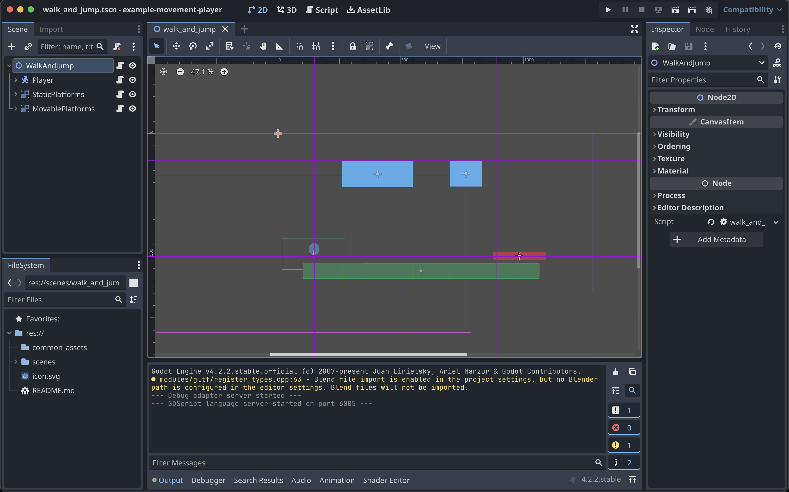
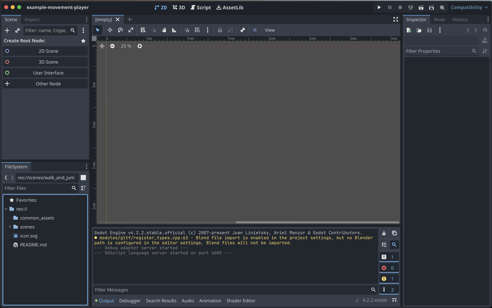
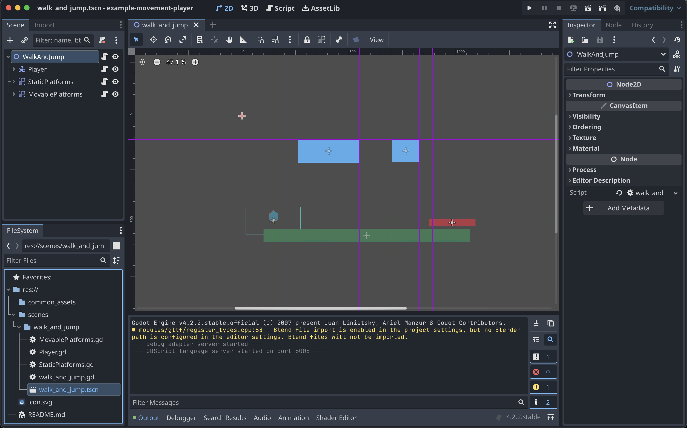
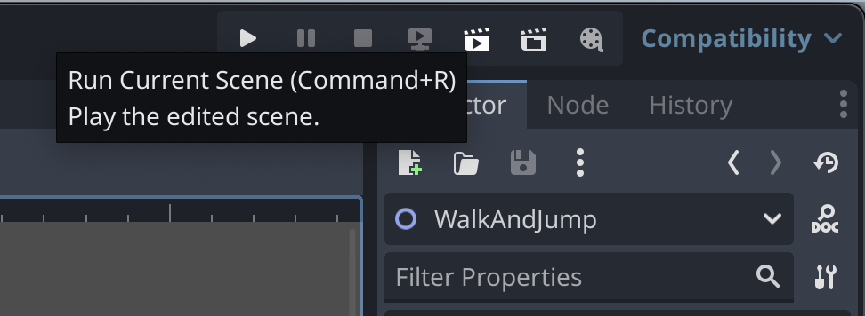

# Example Project: Player Character Movement

This is a Project where we've separated the directory structure to have unique scenes isolated into new subdirectories in the `scenes/` folder.

Each of these scenes are meant to be run separately, directly within Godot, and all assets are either included in the scene's subdirectory, or are reusing elements from the `common_assets` directory.

Unless explicitly stated, we probably haven't tried exporting any of these scenes into their own standalone or deployable apps, and the "Default Scene" for the Project, is probably whichever one was last worked on. So, again, to run or try any of the scenes, you should open the Project in Godot and choose the "Run Current Scene" option, which is tied to `COMMAND` + `R` on macOS.

> ⚠️ __Project File__: As with all the Godot Engine v4.x Projects, the Project file is going to be the `project.godot` file. This is the file you should "Import" when you open the Godot app. The Project file relevant to this README is the `example-movement-play/project.godot`, from which you can then navigate through the separate scenes, in the subdirectories of the `example-movement-play/scenes/` folder.

<!-- MarkdownTOC -->

- [How to Run a Scene](#how-to-run-a-scene)
- [Scenes and their Current State](#scenes-and-their-current-state)
	- [`walk_and_jump`: Player Walking and Jumping with Gravity](#walk_and_jump-player-walking-and-jumping-with-gravity)
- [References](#references)

<!-- /MarkdownTOC -->

## How to Run a Scene

1. Import this Project into Godot, by navigating to the `example-movement-play/project.godot` file.
1. Once opened, you may or may not see the desired Scene already opened.
	1. If you see this, then a Scene is already opened, so you should navigate to the `Scene` menu and choose `Close Scene` (the last option, and on macOS this is tied to `COMMAND`+`SHIFT`+`W`) before continuing to next steps:
		
	1. If you see this, then no scene is open, so you can continue to the next steps:
		
1. In the `FileSystem` section on the bottom-left, you should navigate to expand the `scenes/` directory to the folder with the Scene you want to open.
1. You can now either double-click the `.tscn` file (the Scene file) that has the same name as the directory (indicating it is the "main" scene for that directory), or you can right-click the `.tscn` file and choose `Open Scene`:
	
1. Once the Scene is open, you should again (or for the first time), see something like this, with the 2D view and all the `Node` instances in the scene on the left under the `Scene` section:
	
1. To play the Scene and begin interacting, you will want to look up on the top-right of the window and click the `Run Current Scene` button, which is also tied to `COMMAND`+`R` on macOS:
	
1. The scene should've popped-up in a new window and is now interactive. It should show-up like a separate Window or App in your Operating System (OS), so you can resize the window or move it around however you want, and when you want to close the scene, you can do `COMMAND`+`Q` on macOS, or press the `x` Icon in the pop-up window to close the running Scene.

> 🤓 ___Note___: While a Scene is running, this is essentially "Debug Mode", and with Godot v4.x, the scene is dynamically responding to most changes you make in the code, the Project, or the Node configurations as soon as you save those changes. So if you want to mess around with certain values and see what happens, you usually don't have to close the running Scene app or restart it. Sometimes you will have to reload the Scene, and you'll see that as soon as the Scene starts running, then the `Run Current Scene` button is replaced with a Reload Icon (like: 🔄). If you press that button, the Scene app will be closed and immediately re-opened, so all state and everything will refresh.

## Scenes and their Current State

Each subdirectory in the `scenes/` folder is a separate, isolated Godot "Scene", that is meant to be fully interactive and playable, as a part of this overall Project.

### `walk_and_jump`: Player Walking and Jumping with Gravity

> ℹ️ _See the local [README.md](./scenes/walk_and_jump/README.md) file for more in-depth details._

This is a simple platformer-like example that focuses mostly on walking and jumping movements, including the intricacies of gravity-effects, rotation in air, momentum of a walking jump vs. a standing jump, and interacting with different kinds of platforms that are either static or moving.

This is the first example we've created here in this Project, so it also sets-up a lot of the basics of the overall Project configuration, and is simply using `Polygon2D` instances without any texture or material assets, and there are no sprites or sprite-sheets.

The interactions here are only between platforms (walls, floors, boxes, _etc._) and the Player's `CharacterBody2D` instance.

## References

- `CharacterBody2D` Reference Example: https://docs.godotengine.org/en/stable/tutorials/physics/using_character_body_2d.html
