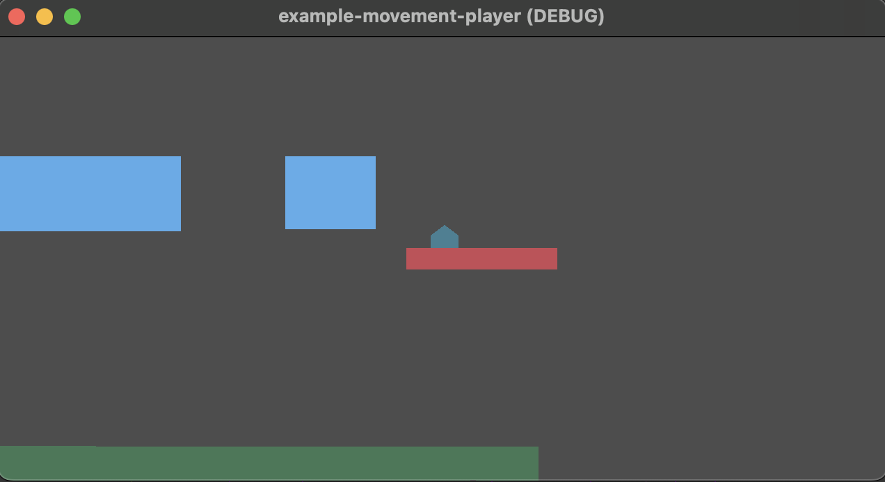

# Scene: Player Character Walking and Jumping on Platforms

<!-- MarkdownTOC -->

- [Scene Context](#scene-context)
- [User Input\(s\)](#user-inputs)
- [References](#references)

<!-- /MarkdownTOC -->

## Scene Context

There's really no context here, this is just the first example we've made and are testing out the basic functionalities and mathematics of a 2D game with the Godot v4.x Engine.

Basically, you're the baseball-base-like Pentagon-shaped object, and you can move around. That's all this is. There's no story, goal, or context, this is much more of a "Tech Demo" than an actual "Game".

## User Input(s)

| Action                | Action ID    | Keyboard Key(s)    | GamePad Buttons |
| --------------------- | ------------ | ------------------ | --------------- |
| Walk Left             | `move_left`  | Left Arrow (⬅️)    | `N/A`           |
| Walk Right            | `move_right` | Right Arrow (➡️)   | `N/A`           |
| Jump                  | `jump`       | Spacebar (`SPACE`) | `N/A`           |
| Duck for Low Jump     | `move_down`  | Down Arrow (⬇️)    | `N/A`           |
| Stretch for High Jump | `move_up`    | Up Arrow (⬆️)      | `N/A`           |
| Rotate Left in Air    | `move_left`  | Left Arrow (⬅️)    | `N/A`           |
| Rotate Right in Air   | `move_right` | Right Arrow (➡️)   | `N/A`           |

## References

- `CharacterBody2D` Reference Example: https://docs.godotengine.org/en/stable/tutorials/physics/using_character_body_2d.html
- `RigidBody2D` Docs: https://docs.godotengine.org/en/stable/classes/class_rigidbody2d.html
- `CharacterBody2D` Docs: https://docs.godotengine.org/en/stable/classes/class_characterbody2d.html
- ...